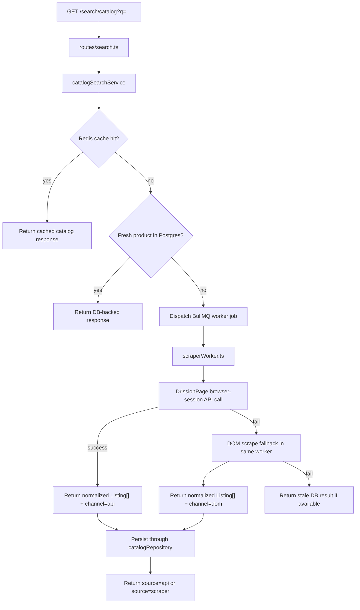

# Design: API-First Search Layer with Browser Fallback

## 1. Architecture Decision
- Keep Node responsible for cache, DB freshness, catalog persistence, and response shaping.
- Keep browser/session ownership inside the existing worker that already owns the DrissionPage browser.
- Upgrade the worker so each search job runs `API first -> DOM fallback`.
- Do not make Node attach to CDP/DevTools in the production search path.
- Do not split one live Shopee session across Python browser control and a separate Node HTTP caller in v1.



## 2. End-to-End Search Order
The overall live search order for `GET /search/catalog` becomes:
1. Redis cache
2. Fresh DB result
3. Worker job:
   - API first
   - DOM fallback
4. Stale DB fallback

This keeps Node-side fast paths intact while moving the live browser-aware logic into the runtime that already owns the session.

## 3. Worker-Owned API Execution
The worker already owns:
- the browser profile
- the live Shopee session
- the anti-bot-sensitive execution context

So the worker should also own the API-first attempt.

### Why this is the preferred v1 model
- no Node-side CDP attach logic
- no cross-runtime cookie/header synchronization
- lower risk of session drift between browser state and API state
- easier to keep behavior realistic because the request originates from the same browser context the operator already validated in DevTools

### Recommended execution model
Inside the Python/DrissionPage runtime:
1. ensure the worker has an active Shopee page/context
2. execute the API request using that live browser session
3. parse the response into the existing listing JSON shape
4. if API execution fails, fall back to the existing DOM extraction path

The important point is not literal "manual console injection". It is programmatic API execution inside the same live browser context.

## 4. Node/Worker Contract
Node should continue dispatching a worker job instead of taking over browser/session logic.

### Existing shape
Today the worker returns:
- `listings`

### Required v1 extension
The worker job result or telemetry should also indicate execution channel:
- `api`
- `dom`

Example conceptual result:
```ts
interface ScraperJobResult {
  listings: Listing[];
  channel: 'api' | 'dom';
}
```

If the current queue result is kept minimal, the same information can travel through telemetry instead, but Node must still be able to map public `source` correctly.

## 5. Worker Runtime Responsibilities
### `scraperWorker.ts`
- keep worker/profile ownership and runnable-state gating
- execute the normal search job
- report profile outcome after job completion
- preserve queue pause/resume behavior for unhealthy profiles

### `scraperService.ts`
- become the Node boundary for "worker API-first search" rather than "DOM-only scrape"
- parse richer worker output and telemetry
- keep post-processing logic compatible with the current `Listing` type

### `scripts/shopee_scraper.py`
- add worker-side API-first logic using the live DrissionPage browser session
- normalize API response into the same listing JSON contract already expected by Node
- fall back to DOM scraping in the same process/context when API fails

## 6. API Request Strategy in the Worker
The worker API call should be executed from the live browser context whenever practical. This keeps:
- cookies
- User-Agent
- CSRF/session headers
- same-origin behavior

as close as possible to the already-authenticated browser state.

Two acceptable worker-side mechanisms:
1. execute a same-origin `fetch(...)` from the browser context
2. extract the live session state inside the worker and issue the HTTP request from the Python side

For v1, same-browser-context execution is preferred because it minimizes session splitting.

## 7. Payload Normalization
Worker API results should normalize into the same listing JSON shape already consumed by Node.

### Core fields
- `title <- item_basic.name`
- `price <- item_basic.price / 100000`
- `shop <- seller display name if present, else String(shopid)`
- `url <- https://shopee.vn/product/{shopid}/{itemid}`
- `image <- https://cf.shopee.vn/file/{image}`
- `marketplace <- shopee`

### Optional fields
These must be guarded:
- rating shape
- sold counters
- promo flags
- seller metadata
- pre-discount price

The worker should emit a consistent JSON structure even when optional API fields are absent.

## 8. Catalog Persistence Strategy
Do not create new top-level tables for this feature.

Node should continue to persist worker output through the current catalog flow:
1. generate product and variant signatures
2. upsert `products`
3. upsert `product_variants`
4. upsert `listings`
5. record `price_history` on change
6. mark product refreshed

This means worker API output and worker DOM output must converge on the same `Listing[]` contract.

## 9. Public Response Contract
Keep the existing `GET /search/catalog` response structure stable:
- `source`
- `product`
- `variantCount`
- `totalListings`
- `listings`

Only the meaning of `source` expands:
- `api` when the worker job succeeded via API
- `scraper` when the worker job required DOM fallback
- existing `cache`, `db`, and `stale-fallback` remain unchanged

## 10. Fallback Rules
Inside the worker job:
- valid API zero-result remains zero-result
- API auth/rate-limit/block/payload/runtime failure triggers DOM fallback
- DOM failure then bubbles back to the existing stale-fallback behavior in Node

This preserves a single worker-owned browser/session path and avoids cross-runtime recovery logic.

## 11. Profile Health and Telemetry
Because both API and DOM attempts happen inside the worker that owns the profile, the profile system can report more truthful outcomes.

Recommended telemetry additions:
- execution channel: `api` or `dom`
- API blocked vs DOM blocked
- API valid-empty vs API failed

This may require generalizing the current scrape telemetry model so it no longer assumes every successful job came from DOM scraping.

## 12. Deferred Work
The following remain deferred until worker API-first page 1 is stable:
- page-2/page-3 expansion
- migration of raw listing routes to the same model
- seller enrichment via a second API
- any Node-side direct API caller built from browser session state
