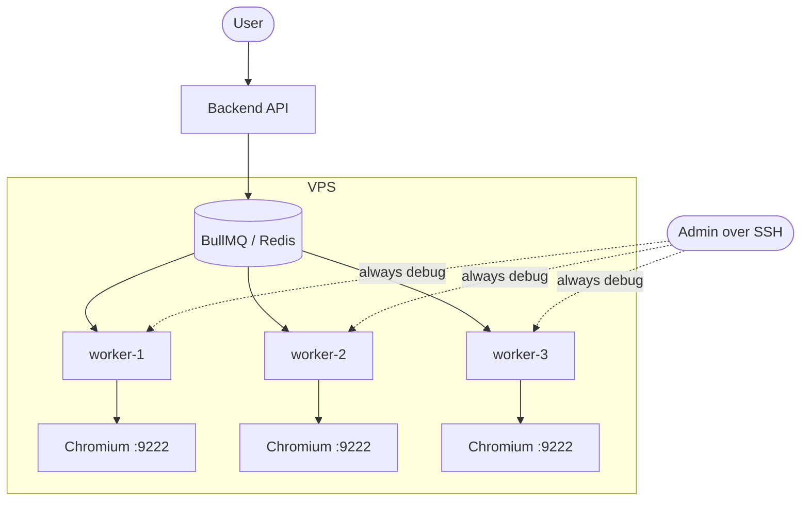

# Design: Multi-Scraper Workers

## 1. Architectural Decision
Use multiple identical scraper worker containers, each owning:

- one BullMQ consumer process
- one Chromium instance listening on container-local port `9222`
- one dedicated profile directory mounted at `/app/shopee_user_profile`

The backend API should enqueue scrape work. It should not depend on a single browser endpoint in production.



BullMQ already provides safe job claiming across multiple consumers on the same queue. The scaling unit is therefore one worker container, not higher local concurrency inside a single worker.

## 2. Why The Current Shape Is Not Enough
The current repository has three blockers that make the original plan incomplete:

1. `scraperWorker.ts` uses `concurrency: 5`, but `shopee_scraper.py` reuses a single browser and fixed tabs. That makes more than one active scrape per worker container unsafe.
2. `catalogSearchService.ts` uses a cluster-wide Redis lock (`df:global_browser_lock`), which serializes scraping across all workers sharing Redis.
3. `docker-compose.yml` still binds the backend to one worker endpoint and references `./proxy.py`, but that file is not present in the repository.

## 3. Worker Contract
Each worker container must follow these rules:

- BullMQ consumer concurrency: `1`
- Chromium remote-debugging port inside container: `9222`
- Profile mount: unique per worker, always mapped to `/app/shopee_user_profile`
- Environment label: `SCRAPER_WORKER_ID=worker-n` for logs and observability

This matches the current Python scraper design:

- `shopee_scraper.py` connects to one browser address
- it enforces a two-tab model (`user` and `maintenance`)
- it stores browser-related state under one profile path

That makes the scraper suitable for multi-worker deployment only if browser ownership stays one-browser-per-worker and one-active-job-per-worker.

## 4. Queue Routing Design
All production scrape entry points should execute through the worker pool:

- `/search`
- `/shopee/best-deals`
- catalog refresh paths currently calling `scrapeListings(...)` directly
- scheduled maintenance that needs browser access

Recommended approach:

1. Use separate dedicated BullMQ queues for different tasks: `scraper` for real-time searches, `catalog-scraper` for background updates, and `maintenance-scraper` for browser-level housekeeping. Also assign dedicated consumers or reserved worker instances to the `scraper` queue. Queue separation alone does not prevent background work from occupying every available worker.
2. Move catalog refresh work into queued jobs instead of direct scraping from the API container.
3. Remove the cluster-wide `df:global_browser_lock` once browser access is fully worker-owned.
4. Keep per-query or per-product dedupe locks if needed, but scope them to duplicate work prevention, not global browser serialization.

## 5. Compose Pattern
Plain `docker-compose.yml` should use an anchor or template pattern plus explicit worker services, because each worker needs a unique profile mount and optional unique debug port.

Example shape:

```yaml
x-worker-base: &worker-base
  build:
    context: .
    dockerfile: Dockerfile
  env_file:
    - .env
  environment:
    REDIS_HOST: redis
    DATABASE_URL: postgresql://${POSTGRES_USER:-postgres}:${POSTGRES_PASSWORD:-postgres_password}@postgres:5432/${POSTGRES_DB:-dealfinder}
    USE_REDIS_MOCK: "false"
    NODE_ENV: production
  restart: unless-stopped
  depends_on:
    - redis
    - postgres

services:
  worker-1:
    <<: *worker-base
    environment:
      SCRAPER_WORKER_ID: worker-1
    volumes:
      - ./shopee_user_profile_1:/app/shopee_user_profile
    ports:
      - "127.0.0.1:9222:9222"

  worker-2:
    <<: *worker-base
    environment:
      SCRAPER_WORKER_ID: worker-2
    volumes:
      - ./shopee_user_profile_2:/app/shopee_user_profile
    ports:
      - "127.0.0.1:9223:9222"
```

Notes:

- Bind debug ports to `127.0.0.1`, not `0.0.0.0`, then inspect them through SSH tunneling.
- Backend-to-worker communication should happen through BullMQ, not by hard-coding one browser host/port in the backend container.
- If `proxy.py` is still required, it must be committed and documented explicitly. Otherwise remove that command and port coupling from compose.

## 6. Backend Service Changes
For the target architecture, the backend API container should:

- keep Redis/Postgres connectivity
- stop depending on `SCRAPER_BROWSER_HOST` / `SCRAPER_BROWSER_PORT` for production scraping
- stop sharing the worker profile volume unless there is a documented reason

If direct scraping remains for any route, then the feature is not complete because the API will still be pinned to one browser endpoint.

## 7. Resource Guidance
- Default rollout on a 3 GB VPS: `2` workers max, plus `2-4` GB swap
- `3` workers should be treated as an opt-in target after soak testing
- Use `restart: unless-stopped`
- Consider `mem_limit` only as a guardrail, not as the primary solution

## 8. Verification Plan
- Start two worker containers and submit at least two distinct scrape jobs concurrently
- Confirm the jobs are processed by different worker IDs
- Confirm no shared profile lock errors occur
- Trigger one worker-side CAPTCHA and verify other workers continue to drain the queue
- Verify SSH debugging reaches the intended worker at `localhost:9222`, `localhost:9223`, and so on, with ports bound to loopback on the VPS host.
