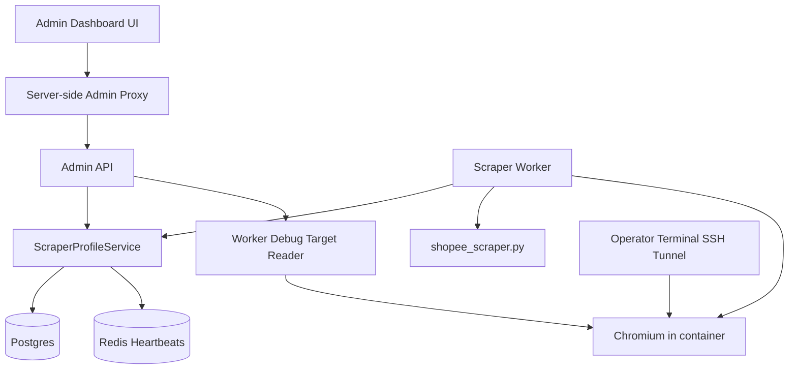

# Design: Scraper Profile Dashboard, Recovery, Warmup, and Stats

## 1. Architecture Decision
- Keep a `1 worker -> 1 Chromium instance -> 1 persistent profile` mapping in v1.
- Add a backend `ScraperProfileService` as the source of truth for profile health, worker ownership, events, stats, recovery state, and operator metadata.
- Add an admin dashboard UI for manual profile creation, monitoring, recovery, warmup, stats, and delete/archive actions.
- Do not seed or hard-code a fixed initial profile count.
- Reuse the already-running remote debugging session for manual recovery instead of spawning a second Chromium process against the same profile directory.
- Keep SSH as the recovery transport in v1, but add backend target discovery so the dashboard can show one-click `Inspect` links after the tunnel is open.



## 2. Security Model
Because the first protection layer is a shared secret header, the dashboard must not call the protected backend API directly from browser code.

### v1 pattern
- Browser talks to dashboard server routes.
- Server routes attach the admin secret and call backend admin endpoints.
- The operator still opens the SSH tunnel manually from a terminal.

This avoids leaking the admin secret and avoids building a full DevTools websocket proxy.

## 3. Dashboard Product Flow
### A. List Profiles
The default dashboard page shows:
- profile name
- status
- assigned worker
- risk score
- last heartbeat
- request count 24h
- success rate 24h
- CAPTCHA count 24h
- quick actions

Quick actions:
- `View`
- `Recover`
- `Warm`
- `Edit`
- `Delete`

### B. Add Profile
1. Admin clicks `Add Profile`.
2. Dashboard form collects:
   - display name
   - assigned worker ID
   - profile mount name
   - container profile path
   - browser host and port
   - browser target port
   - debug tunnel port
   - notes
3. Backend creates the profile in `pending_setup`.
4. UI shows onboarding instructions:
   - provision or update worker/container
   - ensure worker ID matches
   - start worker
5. When the worker claims the profile and heartbeats start, the dashboard reflects live status.

#### Guided commands for add flow
The add flow should include a copyable "Run this on VPS" panel. At minimum the dashboard should generate:
- profile directory creation command
- verification command to confirm the directory exists
- optional worker restart command if the assigned worker already exists

Example command shapes:
```bash
mkdir -p /var/www/dealfinder/backend/shopee_user_profile_3
ls -la /var/www/dealfinder/backend/shopee_user_profile_3
docker compose restart worker-3
```

The exact command strings should be derived from the environment and profile metadata where possible, not hard-coded into UI text.

### C. Recovery
1. Admin opens a profile detail page and clicks `Start Recovery`.
2. Backend sets the profile to `recovering`.
3. Dashboard shows:
   - tunnel command
   - debug tunnel port
   - `Refresh Targets` action
4. Operator runs the SSH tunnel in a terminal.
5. Dashboard calls the DevTools targets endpoint.
6. Dashboard lists only useful page targets with `Inspect` buttons.
7. Clicking `Inspect` opens a local inspector URL such as:
   - `http://127.0.0.1:9223/devtools/inspector.html?ws=127.0.0.1:9223/devtools/page/<targetId>`
8. After login or CAPTCHA solve, admin clicks `Finish Recovery`.
9. Backend transitions the profile to `warming`.

#### Guided commands for recovery flow
The recovery panel should show:
- exact SSH tunnel command
- a note that the command must be run in terminal, not inside the dashboard
- a `Refresh Targets` action after the operator confirms the tunnel is running

Example:
```bash
ssh -L 9223:localhost:9223 user@your-vps
```

### D. Warm Profile
Warmup is automatic after recovery, but the dashboard also exposes manual control.

Actions:
- `Start Warmup`
- `Retry Warmup`
- `View Warmup Progress`

Flow:
1. Profile enters `warming`.
2. Worker runs a low-risk warmup cycle.
3. Dashboard shows warmup status, current streak, and last warmup result.
4. After `2 consecutive successful` warmup runs, the profile returns to `active`.
5. If a warmup fails, the streak resets and the UI shows the failure reason.

### E. View Stats
The dashboard provides:
- summary cards across all profiles
- per-profile stats on the detail page
- recent events table for audit and debugging

### F. Delete Profile
`Delete` in the UI maps to archive/soft-delete in v1.

Flow:
1. Admin clicks `Delete`.
2. UI warns if the profile is assigned, active, or recently heartbeating.
3. Backend refuses deletion if the profile is actively claimed by a runnable worker.
4. If safe, backend marks the profile `archived`.
5. Archived profiles disappear from the default list but remain recoverable for audit.

#### Guided commands for delete flow
Delete in v1 is a guided archive flow. After archive succeeds, the dashboard should show optional cleanup commands for the host profile directory.

Example:
```bash
mv /var/www/dealfinder/backend/shopee_user_profile_3 /var/www/dealfinder/backend/archive/shopee_user_profile_3_2026-03-20
```

If the profile is still assigned to a running worker, the UI should show the blocking reason and the required pre-step, such as stopping or reassigning that worker first.

## 4. Data Model
### Table: `scraper_profiles`
| Field | Type | Description |
|-------|------|-------------|
| id | text primary key | Stable profile identifier |
| display_name | text not null | Human-friendly dashboard label |
| status | text not null | `pending_setup`, `active`, `warning`, `blocked`, `recovering`, `warming`, `cooldown`, `offline`, `archived` |
| risk_score | integer not null default 0 | Bounded score `0-100` |
| assigned_worker_id | text unique | Worker expected to own this profile |
| profile_mount_name | text not null | Logical host-side directory or mount label |
| container_profile_path | text not null | Usually `/app/shopee_user_profile` inside worker container |
| browser_host | text not null | Usually `127.0.0.1` inside worker container |
| browser_port | integer not null | Internal Chromium port, usually `9222` |
| browser_target_port | integer not null | Worker-reachable debug relay port, for example `9223` |
| debug_tunnel_port | integer | Operator's SSH tunnel local port target |
| last_heartbeat_at | timestamptz | Updated every `15 seconds` |
| last_used_at | timestamptz | Last attempted scrape |
| last_success_at | timestamptz | Last successful scrape |
| last_failure_at | timestamptz | Last failed scrape |
| last_captcha_at | timestamptz | Last CAPTCHA or block |
| cooldown_until | timestamptz | Traffic hold until this time |
| recovery_started_at | timestamptz | Recovery session start |
| warmup_success_streak | integer not null default 0 | Must reach `2` to return to `active` |
| archived_at | timestamptz | Soft-delete marker |
| notes | text | Operator notes |
| metadata_json | jsonb not null default '{}'::jsonb | Extensible metadata |
| created_at | timestamptz not null default now() | Audit |
| updated_at | timestamptz not null default now() | Audit |

### Table: `scraper_profile_events`
Append-only event log for:
- status transitions
- risk changes
- worker claim/release
- recovery actions
- warmup results
- delete/archive actions

Suggested fields:
- `id`
- `profile_id`
- `event_type`
- `old_status`
- `new_status`
- `risk_delta`
- `latency_ms`
- `details_json`
- `created_at`

## 5. Stats Design
V1 should derive dashboard stats from:
- current columns in `scraper_profiles`
- recent data in `scraper_profile_events`

### Summary stats endpoint
Return:
- total profiles
- runnable profiles
- blocked profiles
- recovering profiles
- warming profiles
- offline profiles
- archived profiles
- average risk
- CAPTCHA count 24h

### Per-profile stats endpoint
Return:
- request count 24h
- success count 24h
- success rate 24h
- CAPTCHA count 24h
- average latency 24h
- current warmup streak
- last success
- last failure
- last CAPTCHA

## 6. Worker Lifecycle
### Claim and startup
1. Worker reads `SCRAPER_WORKER_ID`, browser config, and profile config.
2. Worker looks up the profile whose `assigned_worker_id` matches its worker ID and is not archived.
3. If found, it claims the profile and starts heartbeating every `15 seconds`.
4. If not found, worker should refuse normal scrape traffic and surface an operational error until the profile is created.

### Runtime
- `active` and `warning` can process user jobs.
- `pending_setup`, `warming`, `blocked`, `recovering`, `cooldown`, `offline`, and `archived` cannot process normal user jobs.
- The worker should pause BullMQ consumption when its profile is non-runnable.
- Keep a defensive in-processor state check in case pause/resume gets out of sync.

### Offline detection
- If heartbeats stop for `90 seconds`, mark the profile `offline`.
- `offline` is operational, not direct risk.

## 7. Traffic Switching Semantics
The earlier concept of "switch profile" can still exist conceptually, but in v1 it works at the worker-traffic level rather than by letting one worker borrow any profile from a shared pool.

### What switching means in v1
When a profile becomes risky or blocked:
1. the backend updates that profile's risk and lifecycle status
2. the owning worker becomes non-runnable
3. that worker pauses BullMQ consumption
4. the remaining healthy workers continue to drain the queue

So the practical result is still "traffic moves away from the bad profile", but the mechanism is:
- `pause bad worker`
- `keep healthy workers running`

not:
- `reuse another profile inside the same worker for the next job`

### Runnable vs non-runnable
- Runnable: `active`, `warning`
- Non-runnable: `pending_setup`, `blocked`, `recovering`, `warming`, `cooldown`, `offline`, `archived`

### Detailed switching flow
#### Clean profile
1. Profile `P1` is `active`.
2. Worker `W1` handles a scrape.
3. Outcome is usable and low-risk.
4. Risk stays low or decreases.
5. `W1` keeps consuming jobs.

#### Degrading profile
1. Profile `P1` starts returning slow or weak results.
2. Risk rises into `warning`.
3. `W1` still runs, but the dashboard shows elevated risk and recent penalties.

#### Blocked profile
1. Profile `P1` hits CAPTCHA.
2. Risk jumps and status becomes `blocked`.
3. `W1` pauses job consumption.
4. Other workers continue to process queue jobs.
5. Operator recovers `P1` through the dashboard plus SSH tunnel workflow.

### Example with 3 workers
- `worker-1 -> profile-A -> active`
- `worker-2 -> profile-B -> active`
- `worker-3 -> profile-C -> blocked`

After `profile-C` is blocked:
- `worker-3` stops taking jobs
- `worker-1` and `worker-2` continue
- traffic has effectively switched away from `profile-C`
- no dynamic pool lease or per-job reassignment is required in v1

### Why v1 still works
This model still gives the important behavior:
- bad profiles stop hurting live traffic
- healthy profiles keep serving
- operators can see exactly why traffic moved away from a profile
- the system stays compatible with the current runtime

## 8. Risk and Transition Rules
### Per-request scoring
- User request baseline: `+1`
- High latency (`>1500ms`): `+5`
- Empty or abnormal result for non-URL search: `+15`
- Scraper exception without CAPTCHA evidence: `+10`
- CAPTCHA or block evidence: `+60` and set `blocked`
- Successful scrape with usable listings: `-4`

Net clean successful request: `-3`.

### Timed decay
- Every `30 minutes`, reduce risk by `2` if status is `active`, `warning`, or `cooldown`.
- Do not apply timed decay while `blocked`, `recovering`, `pending_setup`, `offline`, or `archived`.
- Clamp to `0-100`.

### Score calculation model
Risk is a bounded rolling score:

`next_risk = clamp(current_risk + request_penalties - success_decay - timed_decay, 0, 100)`

Operationally:
1. apply the baseline request cost
2. add any failure or warning penalties
3. subtract success decay only for clearly usable results
4. apply timed decay only from the periodic decay path

### Outcome matrix
| Outcome | Delta | Notes |
|-------|------:|------|
| Request started | +1 | Applied to a normal user scrape attempt |
| High latency only | +5 | Added on top of baseline |
| Empty/abnormal result | +15 | Added on top of baseline |
| Generic scraper exception | +10 | Added on top of baseline |
| CAPTCHA/block evidence | +60 | Added on top of baseline and forces `blocked` |
| Successful usable scrape | -4 | Applied after baseline, net `-3` if no other penalty |

### Worked examples
#### Example 1: clean success
- current risk: `18`
- baseline: `+1`
- success decay: `-4`
- next risk: `15`
- resulting status: `active`

#### Example 2: slow but usable scrape
- current risk: `22`
- baseline: `+1`
- latency penalty: `+5`
- success decay: `-4`
- next risk: `24`
- resulting status: `active`

#### Example 3: empty search result
- current risk: `41`
- baseline: `+1`
- abnormal result penalty: `+15`
- next risk: `57`
- resulting status: `warning`

#### Example 4: CAPTCHA
- current risk: `33`
- baseline: `+1`
- CAPTCHA penalty: `+60`
- next risk: `94`
- resulting status: `blocked`
- worker action: pause queue consumption immediately

### Why decay is required
Without decay, every profile will eventually drift upward forever even if it becomes healthy again. The mixed model here does two different jobs:
- success-based decay rewards real clean traffic
- timed decay slowly heals profiles that are resting or lightly used

### Transition rules
- `pending_setup -> recovering` when admin starts first-time login/recovery.
- `blocked -> recovering` when admin starts recovery.
- `recovering -> warming` when admin finishes recovery.
- `warming -> active` after `2 consecutive successful` low-risk warmup runs.
- failed warmup resets `warmup_success_streak` to `0`.
- `cooldown -> active|warning` only after `cooldown_until` passes and warmup succeeds.
- any active state -> `archived` only if not actively claimed by a runnable worker.

### Threshold meaning
- `0-29`: healthy enough for normal traffic
- `30-59`: degraded but still usable
- `60-79`: should not serve normal traffic until it cools down and warms successfully
- `80+`: unsafe even if no explicit CAPTCHA page is captured

### Warmup interaction
Warmup is part of trust rebuilding, not just a UI status:
1. profile enters `warming`
2. low-risk warmup runs execute
3. clean warmup runs stabilize or reduce risk
4. any failed warmup resets the streak
5. two consecutive successful warmup runs are required before returning to `active`

## 9. DevTools Target Discovery
The dashboard should not embed DevTools or proxy websocket traffic in v1.

Instead, add a helper endpoint that reads targets from the worker's debug endpoint and rewrites them into local inspector URLs for the operator's SSH tunnel port.

### Endpoint
- `GET /api/admin/scraper/profiles/:id/devtools/targets`

### Behavior
- Read `/json/list` from the worker's internal debug endpoint.
- Filter to useful targets, preferring `type === "page"`.
- Ignore noise like iframes, ads, and analytics targets where practical.
- Return:
  - raw target ID
  - title
  - type
  - url
  - `localInspectorUrl`

Example `localInspectorUrl`:
- `http://127.0.0.1:9223/devtools/inspector.html?ws=127.0.0.1:9223/devtools/page/<targetId>`

## 10. Guided Operator UX
The dashboard should function as a guided runbook for non-technical operators.

### UX principles
- show one step at a time
- present copyable commands, not free-form prose only
- explain what the command does in one short sentence
- show a success check or next-step gate before moving forward

### Minimum guided actions
- `Add Profile`: create folder, verify folder, restart or verify worker
- `Recover Profile`: start tunnel, refresh targets, inspect, finish recovery
- `Delete Profile`: archive in app, optionally move/delete folder on VPS

### What the dashboard does not do in v1
- it does not execute terminal commands on the operator's machine
- it does not create host folders itself
- it does not edit Docker Compose automatically
- it does not start SSH tunnel processes directly

## 11. Deferred V2: Shared Pool Switching
If you later want true profile-pool switching, treat that as a separate v2 architecture.

### V2 meaning
- workers do not permanently own one profile
- jobs lease a profile from a shared pool
- the scheduler picks the lowest-risk runnable profile at execution time
- the same profile can later be leased by a different worker

### Additional work required
- shared profile storage accessible across workers
- lease and lock management
- mount portability or remote profile access
- stronger conflict prevention around recovery, warming, and normal traffic
- browser lifecycle changes beyond the current always-on per-worker model

This is intentionally deferred because it is a bigger runtime redesign than the current feature requires.

## 12. API Surface
### CRUD and stats
- `GET /api/admin/scraper/profiles`
- `GET /api/admin/scraper/profiles/summary`
- `POST /api/admin/scraper/profiles`
- `PATCH /api/admin/scraper/profiles/:id`
- `GET /api/admin/scraper/profiles/:id`
- `GET /api/admin/scraper/profiles/:id/stats`
- `POST /api/admin/scraper/profiles/:id/archive`

### Recovery and inspect
- `POST /api/admin/scraper/profiles/:id/recovery/start`
- `GET /api/admin/scraper/profiles/:id/devtools/targets`
- `POST /api/admin/scraper/profiles/:id/recovery/finish`

### Warmup and override
- `POST /api/admin/scraper/profiles/:id/warmup/start`
- `POST /api/admin/scraper/profiles/:id/reset-risk`
- `POST /api/admin/scraper/profiles/:id/status`

## 13. Rollout Notes
- Add schema and profile CRUD first.
- Land worker claim and pause/resume behavior before trusting risk-based state.
- Add recovery target discovery with SSH-assisted inspector links, not a full DevTools proxy.
- Add dashboard stats and archive flow before calling the feature complete.
