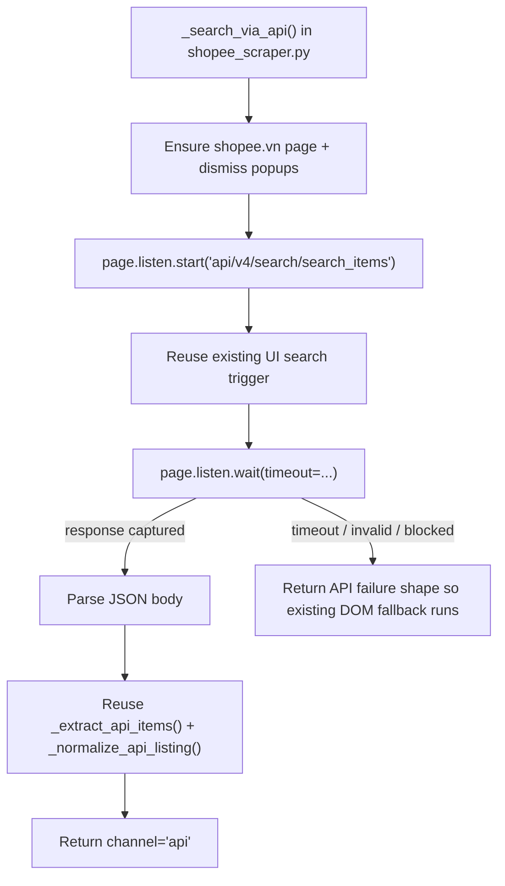

# Design: Replace Direct Shopee Fetch with UI-Triggered Network Capture

## 1. Recommendation
The direction is correct, but the implementation should stay narrow.

- Replace the `run_js(fetch(...))` path inside the existing `_search_via_api()` flow.
- Keep execution ownership exactly where it already is: `shopee_scraper.py` in the Python worker.
- Reuse existing selectors, popup handling, typing behavior, normalization, and DOM fallback.
- Do not introduce a new orchestration layer or a new public worker contract for this change.

`channel`, `apiAttempted`, `apiFailureReason`, and DOM fallback already exist in the current worker path, so V1 does not need extra plumbing there.

## 2. Minimal V1 Flow
Keep the change inside `_search_via_api()` or a very small private helper used only by that method.

1. Ensure the tab is on `shopee.vn` and dismiss common popups.
2. Start a listener for `/api/v4/search/search_items`.
3. Trigger a real search using the existing UI path:
   - locate the search input with current selectors
   - focus and clear it
   - type the query with the existing human-like pacing
   - submit with the current button-or-Enter behavior
4. Wait for the matching network response.
5. Parse the intercepted JSON body.
6. Reuse `_extract_api_items()` and `_normalize_api_listing()` to build the current listing payload.
7. Return the existing runtime result shape with `channel='api'`.
8. If capture fails, return the same failure metadata the caller already uses to trigger DOM fallback.

## 3. Guardrails to Avoid Over-Engineering
- Do not create a generic "network capture framework".
- Do not redesign `scraperWorker.ts`, `scraperService.ts`, or the Node response contract.
- Do not add new schema, telemetry categories, or profile-health subsystems just for this change.
- Do not keep `_fetch_api_page()` around as a no-op. Remove it once the call path is gone.
- Do not design multi-page capture in V1 unless a current caller proves page 1 is insufficient. The first stable win is replacing the detected fetch path for the primary result page.

## 4. Error Handling
- Capture timeout: treat as API failure and let the current DOM fallback run.
- Invalid payload or missing items array: treat as API failure and let DOM fallback run.
- Valid zero-result JSON: keep as a successful API result with `validEmptyResult=True`.
- Block signal such as `90309999`: record the API failure reason and let the existing fallback / profile reporting path handle it.
- CAPTCHA before or during the attempt: keep the current blocked handling behavior.

## 5. Migration Notes
- Update `_search_via_api()` so it no longer depends on `_fetch_api_page()`.
- Reuse the existing UI helpers already present in `shopee_scraper.py` instead of introducing a parallel search trigger implementation.
- Keep `_build_runtime_result()` unchanged.
- Preserve the existing DOM scraping path as the only fallback path for V1.
